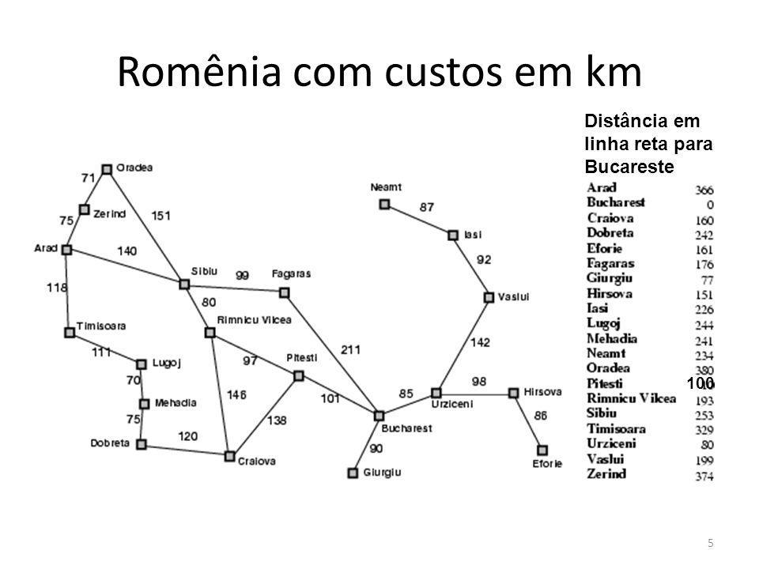

# Algoritmo A*

O algoritmo A* é um algoritmo de busca em grafos que encontra o caminho mais curto entre dois pontos em um grafo ponderado. Ele é amplamente utilizado em jogos, robótica, sistemas de navegação e outros tipos de aplicação.

## Explicação

O algoritmo A* utiliza uma função heurística para estimar o custo do caminho restante até o destino final. A heurística é uma função que fornece uma estimativa do custo de ir do nó atual até o destino final, sem considerar nenhum obstáculo ou custo adicional. Essa função ajuda o algoritmo a escolher os caminhos mais promissores e a evitar a busca em áreas menos importantes do grafo.

O algoritmo A* garante que o caminho encontrado seja o mais curto possível, desde que a heurística utilizada seja admissível, ou seja, que ela nunca superestime o custo real até o destino final. Se a heurística for perfeita, ou seja, se ela fornecer o custo real até o destino final, então o algoritmo A* encontrará o caminho mais curto de maneira eficiente.

## Funcionamento

O algoritmo A* funciona da seguinte maneira:

1. Comece com o nó inicial e o destino final.
2. Inicialize a lista aberta e a lista fechada. A lista aberta contém os nós que ainda não foram visitados, e a lista fechada contém os nós que já foram visitados.
3. Adicione o nó inicial na lista aberta e defina o seu custo total como zero.
4. Enquanto a lista aberta não estiver vazia, selecione o nó com o menor custo total na lista aberta.
5. Se o nó selecionado for o destino final, então o caminho mais curto foi encontrado. Caso contrário, adicione o nó selecionado na lista fechada e explore todos os seus vizinhos.
6. Para cada vizinho do nó selecionado, calcule o custo total como a soma do custo até o vizinho e a heurística do vizinho até o destino final. Se o vizinho já estiver na lista aberta ou na lista fechada, atualize o custo total do vizinho se necessário. Caso contrário, adicione o vizinho na lista aberta com o custo total calculado.
7. Repita o processo a partir do passo 4.

## Problema do Mapa da Romênia

O problema do mapa da Romênia é um problema clássico de busca em grafos, que envolve encontrar o caminho mais curto entre duas cidades da Romênia, representadas por nós em um grafo ponderado. O grafo representa as estradas que conectam as cidades, e cada aresta do grafo tem um custo associado que representa a distância entre as cidades.

O problema é desafiador porque a Romênia tem muitas cidades e estradas, e encontrar o caminho mais curto entre duas cidades pode exigir a exploração de muitos caminhos possíveis. Além disso, algumas estradas podem ser mais lentas ou ter um custo maior do que outras, o que significa que o caminho mais curto pode não ser o mais óbvio.

O problema do mapa da Romênia é um exemplo clássico de um problema de busca em grafos, e é frequentemente usado como um caso de teste para algoritmos de busca em inteligência artificial e algoritmos de otimização. Algoritmos como o algoritmo A* podem ser usados para resolver o problema do mapa da Romênia e encontrar o caminho mais curto entre duas cidades de maneira eficiente.

<div align="center">



</div>

No nosso caso específico, queremos ir de Arad a Bucareste.

### Heurística definida

No exemplo da imagem, a heurística é a distância em linha reta de Bucareste a todos os pontos do mapa.

No código do algoritmo, a heurística já foi fornecida diretamente, mas caso não estivesse disponível, seria necessário ter as coordenadas de cada ponto em um plano para calcular as distâncias em linha reta do destino a cada um dos nós e fornecer a heurística. Isso poderia ser feito utilizando fórmulas matemáticas simples para calcular a distância euclidiana entre dois pontos em um plano.

## Como Configurar o Ambiente de Desenvolvimento

### Dependências

- `Python 3.10.9` (Versão utilizada para desenvolvimento, mas o código aparenta ser compatível com todas as versões do Python3)

### Como clonar o repositório

```bash
git clone git@github.com:ed-henrique/ia.git
cd ia
cd a*
```

### Como executar o código

```bash
python3 a*.py
```

## Referências

- [A* Search Algorithm by StackAbuse](https://stackabuse.com/courses/graphs-in-python-theory-and-implementation/lessons/a-star-search-algorithm/)